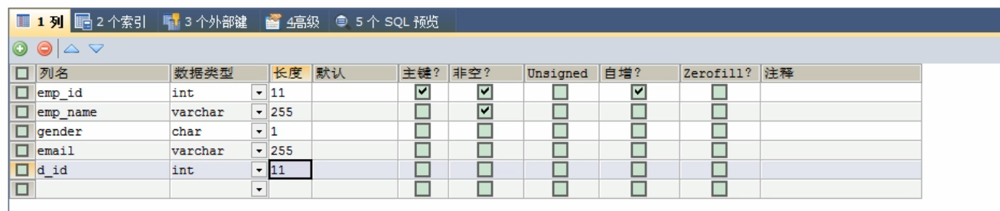
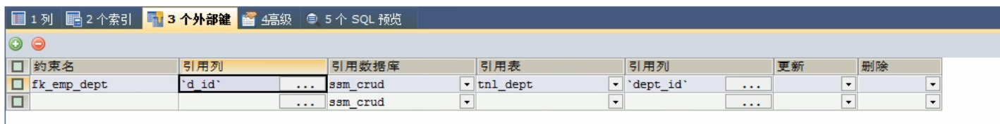
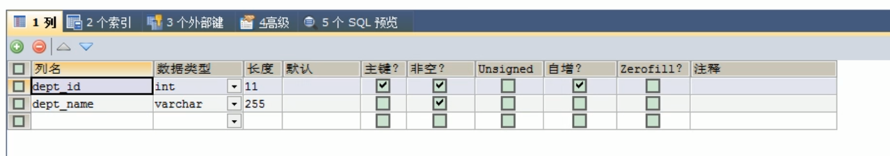

# ssm-crud
Begin in 2021/11/23

## 功能点
1. 分页
2. 数据校验
   * jquery前端校验+JSR303后端校验
3. ajax异步请求
4. Rest风格的URI；使用HTTP协议请求方式的动词，来表示对资源的操作（GET（查询），POST（新增），PUT（修改），DELETE（删除））

## 技术栈
1. 基础框架-ssm（SpringMVC+Spring+MyBatis） 
2. 数据库-MySQL
3. 前端框架-bootstrap快速搭建简洁美观的界面 
4. 项目的依赖管理-Maven 
5. 分页-page helper 
6. 逆向工程-MyBatis Generator
7. Tomcat服务器

## 数据库配置

数据库名：ssm_crud

### 表一
表名：tbl_emp  
  
定义外键：  

### 表二
表名：tbl_dept  

## 技术问题
1. [Tomcat服务器启动时控制台乱码怎么办](issue/Tomcat服务器启动时控制台乱码的解决方案.md)

## 一些说明
1. mbg.xml是用于Mybatis配置逆向工程