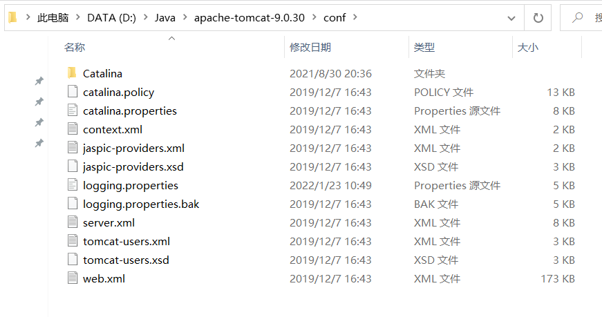

# Tomcat服务器启动时控制台乱码的解决方案
Tomcat版本9.0.32
1. 打开Tomcat服务器安装目录，并进入conf文件夹  

2. 打开logging.properties文件，并将配置修改成如下
```
1catalina.org.apache.juli.AsyncFileHandler.level = FINE
1catalina.org.apache.juli.AsyncFileHandler.directory = ${catalina.base}/logs
1catalina.org.apache.juli.AsyncFileHandler.prefix = catalina.
1catalina.org.apache.juli.AsyncFileHandler.maxDays = 90
1catalina.org.apache.juli.AsyncFileHandler.encoding = UTF-8

2localhost.org.apache.juli.AsyncFileHandler.level = FINE
2localhost.org.apache.juli.AsyncFileHandler.directory = ${catalina.base}/logs
2localhost.org.apache.juli.AsyncFileHandler.prefix = localhost.
2localhost.org.apache.juli.AsyncFileHandler.maxDays = 90
2localhost.org.apache.juli.AsyncFileHandler.encoding = UTF-8

3manager.org.apache.juli.AsyncFileHandler.level = FINE
3manager.org.apache.juli.AsyncFileHandler.directory = ${catalina.base}/logs
3manager.org.apache.juli.AsyncFileHandler.prefix = manager.
3manager.org.apache.juli.AsyncFileHandler.maxDays = 90
3manager.org.apache.juli.AsyncFileHandler.encoding = UTF-8

4host-manager.org.apache.juli.AsyncFileHandler.level = FINE
4host-manager.org.apache.juli.AsyncFileHandler.directory = ${catalina.base}/logs
4host-manager.org.apache.juli.AsyncFileHandler.prefix = host-manager.
4host-manager.org.apache.juli.AsyncFileHandler.maxDays = 90
4host-manager.org.apache.juli.AsyncFileHandler.encoding = UTF-8

java.util.logging.ConsoleHandler.level = FINE
java.util.logging.ConsoleHandler.formatter = org.apache.juli.OneLineFormatter
java.util.logging.ConsoleHandler.encoding = UTF-8
```
3. 重新启动服务器即可